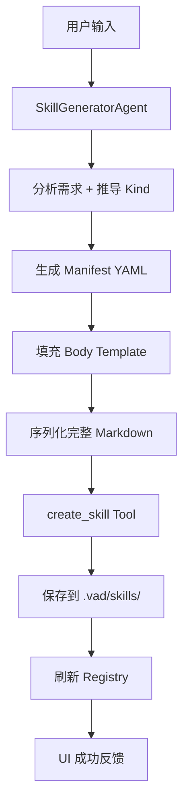

# Skill Generator - 使用指南

## 🎯 功能概述

侧边栏 Agent 可以帮助用户通过自然语言描述生成自定义 Skill（SKILL.md 文件）。

## 🚀 快速开始

### 1. 在右侧 Chat Sidebar 中使用

用户可以在聊天界面输入：

```
"帮我创建一个小红书封面生成技能"
"我想做一个游戏宣传图生成的 skill"
"创建一个 SaaS 落地页生成器"
```

系统会自动：
- 分析用户需求并推导 Skill kind
- 生成完整的 SKILL.md 文件
- 保存到 `.vad/skills/` 目录
- 立即显示在技能管理中

### 2. API 调用

```bash
curl -X POST http://localhost:3000/api/skills/generate \
  -H "Content-Type: application/json" \
  -d '{"input": "帮我创建一个小红书封面生成技能"}'
```

响应：

```json
{
  "success": true,
  "message": "✅ Skill 已创建：为用户输入的\"帮我创建一个小红书封面生成技能\"创建的自定义设计技能",
  "skillId": "xiaohongshu-xhs-skill"
}
```

## 📦 技术架构

### 核心组件

| 文件 | 说明 |
|------|------|
| `src/lib/agents/tools/create-skill.ts` | create_skill 工具定义 |
| `src/lib/agents/skill-generator-agent.ts` | SkillGeneratorAgent 主逻辑 |
| `src/app/api/skills/generate/route.ts` | REST API 端点 |
| `src/components/skills/skill-generator-panel.tsx` | UI 面板组件 |
| `src/lib/agents/skill-generator-agent.test.ts` | 单元测试 |

### 数据流



## 🧩 支持的技能类型

| Kind | 用途 | 示例输入 |
|------|------|---------|
| `prototype` | Web/App原型 | "APP 原型生成" |
| `landing` | 落地页 | "SaaS landing page" |
| `xhs` | 小红书封面 | "小红书封面" |
| `game-art` | 游戏素材 | "游戏角色设计" |
| `product-shot` | 产品图 | "电商产品图" |
| `promo-kv` | 宣传海报 | "品牌主视觉" |
| `style-board` | 风格板 | "情绪板生成" |
| `mobile` | App 界面 | "iOS 应用界面" |
| `dashboard` | 后台面板 | "数据可视化看板" |
| `deck` | 演示文稿 | "PPT 幻灯片" |
| `template` | 模板填充 | "简历模板" |

## 🔧 工作原理

### 1. Kind 推导逻辑

```typescript
deriveSkillKindFromIdea(input) {
  if includes("小红书"/"xhs") → "xhs"
  else if includes("落地页"/"landing") → "landing"
  else if includes("游戏"/"game") → "game-art"
  else if includes("产品"/"product") → "product-shot"
  else if includes("原型"/"prototype") → "prototype"
  // ...更多规则
  return "prototype" // 默认
}
```

### 2. Manifest 自动生成

基于推导结果，自动构建符合 schema 的 manifest：

```yaml
name: xiaohongshu-xhs-cover
description: 为你的需求创建的自定义设计技能
kind: xhs
version: "1.0.0"
author: user
inputs:
  - name: idea
    type: string
    required: true
  - name: tone
    type: select
    options: [enterprise, modern, playful, premium]
output:
  artifact: xhs-cards
  defaultPageSize:
    width: 750
    height: 1334
agent:
  steps: [brief, layout, image, critic, repair]
  imageRequired: true
  repairThreshold: 8.5
```

### 3. Body Template 注入

根据 kind 选择对应的 prompt 模板，包含具体的设计规范、工作流程和质量要求。

## ✅ 测试

运行单元测试：

```bash
pnpm test src/lib/agents/skill-generator-agent.test.ts
```

预期输出：

```
✓ deriveSkillKindFromIdea > should detect xhs kind from '小红书封面生成'
✓ deriveSkillKindFromIdea > should detect landing kind from '落地页'
✓ deriveSkillNameFromIdea > should create name for xhs skill
✓ runSkillGeneratorAgent > should generate skill from simple input
```

## 🔄 集成到现有代码库

1. **注册工具** - `src/lib/agents/tools/index.ts`:
   ```typescript
   import { createSkillTool } from "./create-skill";
   toolRegistry.register(createSkillTool);
   ```

2. **导出 helper 函数** - 方便测试：
   ```typescript
   export function deriveSkillKindFromIdea(input: string): SkillKind { ... }
   export function deriveSkillNameFromIdea(input: string): string { ... }
   ```

3. **API 路由** - 新文件自动生效：
   ```
   src/app/api/skills/generate/route.ts
   ```

## 📝 下一步计划

### Phase 1 (当前完成)
- ✅ Core Agent Logic
- ✅ Create Skill Tool  
- ✅ REST API Endpoint
- ✅ Basic UI Component

### Phase 2 (待实现)
- [ ] LLM Integration for smarter analysis
- [ ] Skill Template Library
- [ ] Skill Versioning System
- [ ] Skill Marketplace Publishing

### Phase 3 (未来扩展)
- [ ] AI-Assisted Editing
- [ ] Skill Testing Mode
- [ ] Multi-language Support
- [ ] Export to Other Formats

## 💡 使用技巧

### 更好的输入

❌ **模糊**: "我想要一个技能"  
✅ **具体**: "帮我创建一个用于生成电商产品白底图的 skill，需要高清细节"

❌ **模糊**: "生成图片"  
✅ **具体**: "我想做一个游戏 RPG 的角色概念设计技能，支持奇幻风格"

❌ **模糊**: "做 landing"  
✅ **具体**: "创建 SaaS product landing page 生成器，要 enterprise 风格"

### 支持的关键词映射

| 中文 | 英文 | 映射到的 Kind |
|------|------|------------|
| 小红书 | xhs / cover | xhs |
| 落地页 | landing page | landing |
| 游戏 | game | game-art |
| 产品 | product | product-shot |
| APP/小程序 | prototype | prototype |
| 宣传主视觉 | promo | promo-kv |
| 风格板 | style board | style-board |

---

**作者**: Vibeboard Team  
**版本**: 1.0.0  
**更新日期**: 2026-08-24
