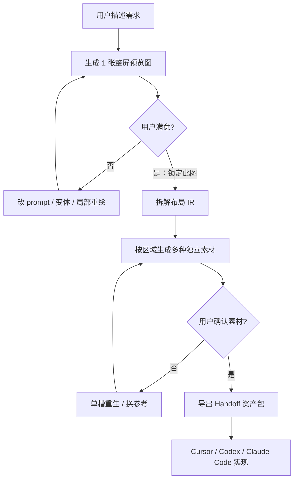

# 终态方案：满意整图 → 拆解多素材 → 编码资产包

**日期：** 2026-07-22  
**产品选择：** ① 设计资产包（代码全靠 Cursor / Codex / Claude Code）  
**状态：** 终态产品规格（取代「仅切图」作为目标形态）  
**关联：** 前稿 `2026-07-22-handoff-asset-pack-design.md` 中的切图能力降级为 **素材生成前的草稿/回退**，不再是终交付主路径。

---

## 0. 一句话

用户先认可 **一张整屏 UI 图** → 系统 **按该图拆出并重新生成多种独立素材** → 打包成带完整细节的资产包 → 编码 Agent **按图纸（IR）引用零件（materials）实现 UI**，而不是猜一张烤平图。

---

## 1. 用户旅程（产品主路径）



### 阶段说明

| 阶段 | 用户看到什么 | 系统做什么 |
|------|--------------|------------|
| **① 出图** | 1 张（或少量）整屏 mockup | 现有 `generate_images` |
| **② 锁定** | 「满意，拆成素材」按钮 / Agent 确认 | 将该 asset 标为 `approvedMockup` |
| **③ 拆解** | 布局框图叠加在原图上（可选） | Vision：regions + bbox + copy + role |
| **④ 出零件** | 素材面板出现多张独立图 | 按槽位 **再生成**（以锁定图为参考），不是只裁切 |
| **⑤ 确认零件** | 可对单个槽位「重做」 | 更新 materials 绑定 |
| **⑥ 打包** | 下载 zip / 复制 kickoff | 写入 IR + materials + DESIGN/SKILL + 明细文档 |

**关键产品决策：**  
- 日常创作仍可「只先出一张图」。  
- **交给编码 Agent 前**，必须经过 ②→⑤（或用户显式跳过并接受质量下降）。  
- 终交付的权威媒体是 **`assets/materials/*`（独立生成）**，不是裁切碎片。

---

## 2. 为什么不是「只切图」

| | 只切图 | 按满意图再生成多素材（本方案） |
|--|--------|--------------------------------|
| 边缘/文字 | 常切到字、控件 | 零件可要求透明底、无 UI 铬 |
| 编码可用性 | 凑合 | **可直接 ``** |
| 与用户意图 | 被动 | 「按我认可的那张」主动对齐 |
| 成本 | 低 | 多几次生图（可接受，换还原度） |

裁切仅用于：  
- 快速预览槽位框；  
- 生图失败时的 fallback；  
- 给二次生成当 crop 参考（img2img / 局部参考）。

---

## 3. 数据模型

### 3.1 锁定的整图

在 `ImageAsset` 上增加（或等价 scratch/project 字段）：

```ts
approval?: {
  status: "draft" | "approved" | "materializing" | "materials_ready";
  approvedAt?: string;
  /** 拆解出的布局 IR id / 内嵌 */
  layoutId?: string;
};
```

### 3.2 素材槽位 MaterialSlot

```ts
type MaterialSlot = {
  id: string;                    // = layout node id，如 hero / bg / avatar-1
  parentAssetId: string;         // 锁定的整图 id
  role: "hero" | "illustration" | "background" | "avatar" | "icon" | "decoration" | "other";
  bbox: { x: number; y: number; w: number; h: number }; // 相对整图 0–1
  rebuildInCode: false;          // 媒体槽恒为 false
  prompt: string;                // 由整图+区域 vision 生成的专用英文 prompt
  status: "pending" | "generating" | "ready" | "failed";
  /** 生成得到的独立 ImageAsset id */
  materialAssetId?: string;
  /** 可选：裁切草稿（fallback） */
  cropPreviewSrc?: string;
  matchedReferenceId?: string;
  notes?: string;
};
```

### 3.3 代码槽位（不生图）

```ts
type CodeSlot = {
  id: string;
  role: "nav" | "cta" | "form" | "footer" | "card" | "other";
  bbox: { x: number; y: number; w: number; h: number };
  rebuildInCode: true;
  copy?: string;
  suggestedComponent?: string;
  states?: Array<{ name: string; notes: string }>;
};
```

### 3.4 Layout IR（打包权威）

```ts
type LayoutIR = {
  version: 1;
  mockupAssetId: string;
  width: number;
  height: number;
  referenceImage: string;          // assets/final/mockup-...
  nodes: Array<
    | (MaterialSlot & { media: string; rebuildInCode: false })
    | (CodeSlot & { media: null; rebuildInCode: true })
  >;
  /** 可选嵌套 */
  // children via nested nodes in Phase B
};
```

项目内可存：`project.materializations[mockupAssetId] = { layout, slots }`。

---

## 4. 「按该图生成多种素材」流水线

工具建议名：`materialize_approved_mockup`（或 Agent 多步：`extract_layout` → `generate_materials`）。

### Step A — 拆解（Vision）

输入：锁定整图 + brief/direction。  
输出：

- 媒体槽列表（必须带 bbox + role + 专用 prompt）  
- 代码槽列表（copy、suggestedComponent、states）  
- tokens 草案、don'ts  

Vision 提示要点：

- 区分 **bitmap 媒体** vs **应用 UI 铬**  
- 媒体槽 prompt：**只描述该零件本身**（subject, style, transparent/isolated background），**禁止**再描述整屏手机框/按钮文字  
- 注明风格必须与锁定图一致（color grade, hardcore/neon 等）

### Step B — 按槽生成素材

对每个媒体槽：

1. 用锁定整图作为 **style / composition reference**（现有 `referenceIds` 管线）  
2. 可选：用 bbox crop 作为局部参考（提高位置一致性）  
3. 调用图像模型生成 **独立素材**（建议透明或干净底，role 写入 `asset.role`）  
4. 写入 `project.assets[]`，`parentAssetId = mockupId`，`source: "materialized"`  
5. 绑定 `slot.materialAssetId`

并行策略：槽位可并行 Job；失败单槽重试，不阻断整包。

### Step C — 用户确认

UI：

- 左：锁定整图 + 框选叠加  
- 右：各槽位缩略图  
- 操作：单槽「重做」、换参考、删除槽、手动「标记为代码实现」  

确认后 → `materials_ready`。

### Step D — 打包 Handoff

见 §5。

---

## 5. 编码 Agent 资产包内容

```
handoff/
  README.md
  DESIGN.md                      # 外观 + Don'ts
  LAYOUT.md                      # 如何读 IR / 材料
  MATERIAL_MAP.md                # 每个零件：路径、role、对应整图区域、用法
  SPEC.md / IMPLEMENTATION.md / ASSET_MAP.md
  skills/design-to-code/SKILL.md
  design/
    layouts/<mockupId>.json      # Layout IR（权威）
    layouts/index.json
    specs/<mockupId>.*           # 整图规格
    tokens.json
    tokens.dtcg.json             # 可选
    brief.json / direction.json / project.json
  assets/
    final/                       # 锁定整图（对照真理）
    materials/                   # ★ 独立生成的零件（实现时引用）
      <mockupId>/
        hero.png
        background.png
        illustration-01.png
        ...
    references/                  # 用户原参考（若有）
    slices/                      # 可选：裁切草稿，标注 non-authoritative
    manifest.json
  prompts/{cursor|claude-code|codex}-kickoff.md
  .cursorrules | CLAUDE.md | AGENTS.md
  handoff-report.json
```

### Kickoff 必须写清的细节（让 Agent「弄明白」）

1. **整图用途**：只作视觉对照与验收，禁止整图当唯一背景糊弄。  
2. **材料用途**：`rebuildInCode:false` 节点的 `media` 路径必须使用。  
3. **代码用途**：`rebuildInCode:true` 节点用真实组件 + `copy` + `states`。  
4. **阅读顺序**：DESIGN → LAYOUT → `design/layouts/*` → MATERIAL_MAP → materials → final。  
5. **范围**：有材料/IR 的屏幕才实现；不要发明未锁定的页。  
6. **验收**：实现后与 `assets/final` 对照层级/密度/色调；媒体区应能认出是包内材料。

---

## 6. UI / Agent 入口

| 入口 | 行为 |
|------|------|
| 素材卡 / 画布选中图 | 「满意并拆成素材」 |
| Agent 对话 | 「这张我满意，拆素材打包」→ 调 materialize 工具 |
| Handoff 对话框 | 未 `materials_ready` → 强警告或引导先拆解；允许「仅整图导出（质量差）」高级选项 |
| 拆解完成后 | 「导出给 Cursor / Codex / Claude」 |

---

## 7. 与现有能力对齐

| 现有 | 用法 |
|------|------|
| `generate_images` | 阶段①整图 |
| `generate_image_variants` / 局部重绘 | 阶段①不满意时迭代 |
| `designSpec` / `extract-asset-spec` | 阶段③拆解基础，扩展强制媒体 bbox + 槽位 prompt |
| `referenceIds` 生图 | 阶段④以锁定图为参考生成零件 |
| `export_handoff` | 阶段⑥；要求写入 materials + IR + MATERIAL_MAP |
| parentAssetId / role | 材料资产溯源 |

---

## 8. 分阶段实现（仍服务终态）

### P0 — 可演示闭环

1. 锁定整图状态  
2. Vision 拆解 → Layout IR（含媒体/代码槽）  
3. 按槽再生成 materials（参考锁定图）  
4. Handoff 打包 materials + IR + DESIGN/SKILL/MATERIAL_MAP/kickoff  

### P1 — 体验与质量

- 框选预览 UI、单槽重做  
- 参考图匹配、透明底约束  
- DTCG tokens、嵌套 layoutHint  
- Preflight：无 materials 则警告  

### P2 — 加强

- 槽位并行 Job、成本预估  
- 用户拖拽调 bbox 再生成  
- 视觉 diff 验收说明（仍不强制跑浏览器）  

---

## 9. 成功标准

- 用户路径：**1 张满意图 → 多张零件 → 一个 zip**。  
- Zip 内编码 Agent 能不靠猜：知道哪些用文件、哪些写代码、文案是什么、不要重绘什么。  
- 实现结果：媒体区可辨认为包内 `materials/*`，而不是模型臆造的新插画。  

---

## 10. 明确不做

- 不在 Vibeboard 内生成完整生产级 React 工程（可另议脚手架）。  
- 不强迫用户「一开始就生 10 张零件」——先整图满意再拆。  
- 不以裁切作为终交付主路径。  

---

## 11. 规格自检

- 用户原话「先一张 → 满意 → 多种素材 → 打包并讲清细节」已完整覆盖。  
- 与选择①一致：资产包 + 编码 Agent 写代码。  
- 切图降级为辅助，终态是 **再生成 materials**。  
